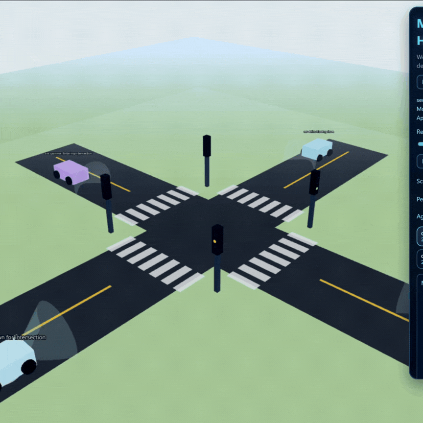

# SensAI Mission Control XR

A WebXR 3D dashboard that visualizes autonomous vehicle decision-making in real time. Watch AI-driven cars navigate city intersections and highways, see their "thought bubbles", and verify tamper-evident audit logs -- all in VR or on desktop.

<p align="center">
  
</p>

---

## Quick Start

**Prerequisites:** [Node.js](https://nodejs.org/) (v18+) and npm.

```bash
# 1. Clone the repo
git clone https://github.com/Aravind-11/sensaihack-idea1.git
cd sensaihack-idea1

# 2. Install dependencies (required after every fresh clone)
npm install

# 3. Start the dev server
npm run dev
```

Open **http://localhost:5173** in your browser. That's it.

---

## Running on a PICO Headset (USB)

Make sure your PICO is connected via USB with developer mode enabled, then:

```bash
npm run vr:usb
```

This single command waits for the device, sets up port forwarding, and starts the server. Then open **http://localhost:5173** in PICO Browser.

Other headset helpers:

| Command | What it does |
|---|---|
| `npm run vr:usb:check` | Check device connection and port forwarding status |
| `npm run vr:usb:clear` | Remove port forwarding |

---

## All Available Commands

| Command | What it does |
|---|---|
| `npm install` | Install dependencies (run this first!) |
| `npm run dev` | Start dev server on localhost |
| `npm run dev:host` | Start dev server accessible on your local network |
| `npm run vr:usb` | Start dev server + set up PICO USB forwarding |
| `npm run build` | Build for production |
| `npm run preview` | Preview the production build locally |
| `npm run lint` | Run ESLint checks |

---

## What You'll See

- **3D Vehicles** driving through city intersections or highway lanes with real-time "thought bubbles" showing each agent's intent, perception, and confidence
- **Two Scenarios** -- City Merge (intersection with traffic lights) and Highway (multi-lane overtake/merge)
- **Replay Scrubber** -- rewind and fast-forward the simulation tick-by-tick
- **Tamper-Evident Audit Logs** -- every agent event is cryptographically chained (SHA-256 + HMAC); click "Verify" to check integrity
- **AI Audit Diagnosis** -- automated anomaly detection (low confidence, excessive speed, etc.)
- **WebXR** -- enter immersive VR on any WebXR-capable headset, or use WASD + mouse on desktop

---

## Project Structure

```
src/
├── App.tsx                    # 3D scene, XR setup, world geometry, agent rendering
├── audit/
│   ├── clientLog.ts           # Tamper-evident log chain (Web Crypto API)
│   ├── cityMergeDrafts.json   # City merge scenario trajectory data
│   ├── highwayDrafts.json     # Highway scenario trajectory data
│   ├── diagnostics.ts         # AI audit diagnosis engine
│   └── replay.ts              # State reconstruction & interaction extraction
├── components/
│   ├── MissionControl.tsx     # HUD panel: logs, scrubber, agent cards, diagnosis
│   └── SpatialAgent.tsx       # 3D agent with car body, thought text, vision cone
└── types/
    └── audit.ts               # TypeScript types for events, payloads, agent state
```

---

## Tech Stack

React 19, TypeScript, Vite, Three.js, @react-three/fiber, @react-three/xr, Web Crypto API
